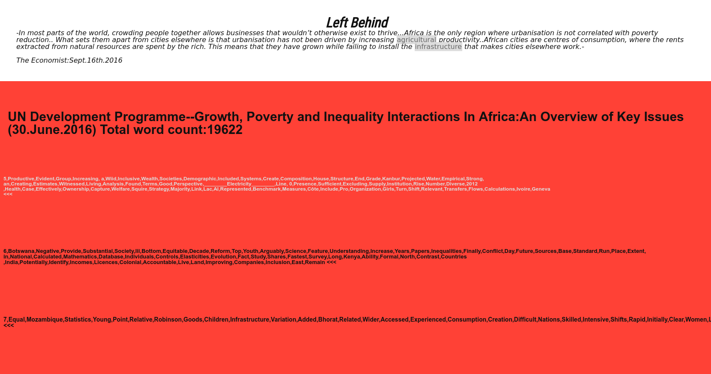
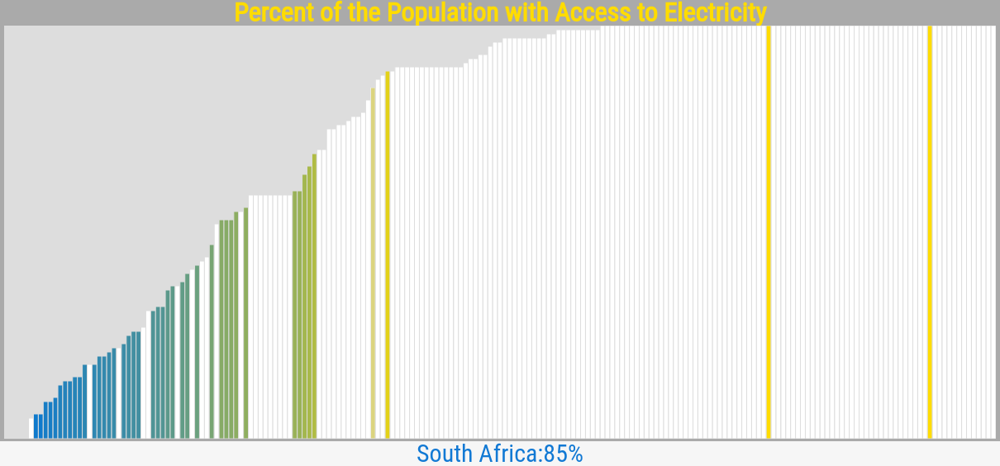
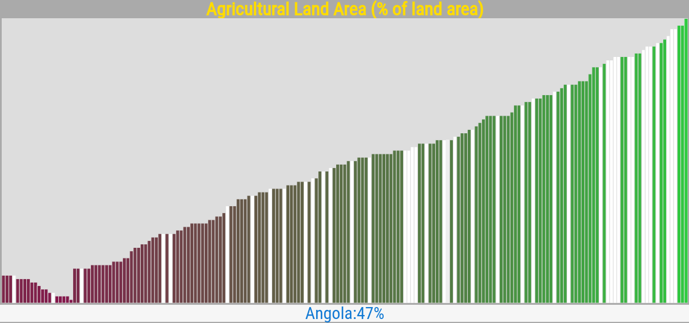
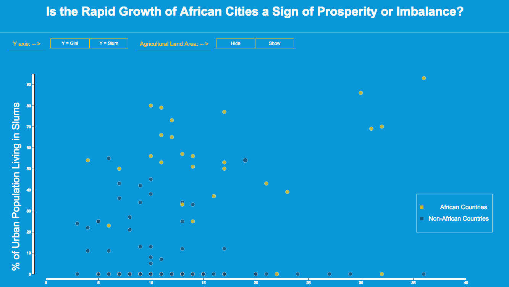

### Is the Rapid Growth of Urban African Cities a Sign of Prosperity or Imbalance?
This research, in collaboration with the United Nations Development Programme aims to delve deeper and uncover fact based insights into the topic of economic inequality in Urban centers of Sub-Saharan Africa. 

>Studying power grid infrastructure and agriculture in order to find out who/why/how it is that there are regions without access to electricity and who/why/how Africa imports food. Doing so in order to understand how/why/what governments are spending money on if not this. Considering/comparing/using financial and economic variables such as government debt and expenditure. My visualization is based on WorldBank world development indicators data.

#### Contents:
##### Code section
1. qualData: Contains application code for NLP exploratory research and application.
2. quantData: Contains code for data wrangling and aggregation, initial exploratory quantitative analysis, and application code for prototype application
3. quant2: Contains code for final presentation application, and analytical code for further exploration and hypothesis testing. 
(.csv, .txt files are data sources) 
(.py, .ipynb, and .awk files are data aggregation and exploration code) 
(.js, .html, and .css files are application code files)

##### Research and Report Section
1. Initial research
2. Breadth research
3. Depth research
4. Formulate question
5. Test Question
6. Results

### stage 1.
#### "Key Issues Report" whitepaper, identify topic, consult with UNDP project lead
The entry point into our research was via the "Overview of Key Issues Report" provided to us by the UNDP. We read the paper consulted the referenced data and research sources, and formulated topical questions (See "Questions" section below) to pose to the director of the department to flesh out potential avenues of research.

Researching historical instances of economically and financially ruined or struggling countries which were able to recover or develop successfully there were indications that the recovery of the US from the Great Depression was partly enabled by financial and economic maneuvering through debt and free market incentive ["what ended the great depression":fee.org]. Led by this and feedback from the UNDP on my initial questions, direction was taken to research deeper into what the economic and financial landscape of Africa that gave rise to the recent growth to see if there were parallel circumstances and if so what was different and potentially contributing to the economic inequality. 

### stage 2.
#### Locating other sources of research and data
We then branched out finding supplemental research (See "Reference" and "Supplemental Sources" sections below) in order to begin to formulate a test question and then to subsequently search for or create viable data-sources for testing the topic.

Qualitative text analysis was conducted of the "Key issues report" to gauge and identify further key topics through topic and word frequency

### stage 3. 
#### Formulating research question/hypothesis
The core sources however indicated that the inquiry into whether or how to introduce more sophisticated economic and financial possibilities into to market, whether through government or industry, were premature to say the least and that most countries in Africa lacked the basic infrastructure to even begin considering investing in such ventures. Moreover there seemed to be indication that while the economy had shown recent growth it was not driven by similar developments in infrastructure and agriculture, but rather just the opposite. 

>"In SSA(Sub-Saharan Africa), weak correlation was found between changes in average private consumption from the household
surveys and changes in GDP per capita from the national accounts.
This contrasts with the experience in the rest of the world, where a percentage point increase in GDP
from the national accounts yielded on average a one percent increase in average private consumption.
And the elasticity of poverty to GDP was also statistically significant in the rest of the world."
“Inequality and Economic Growth: The Perspective of the New Growth Theories.”[Aghion et al.]

This revelation lead to more focus on what was the cause of this disparity; In an article published by the Economist magazine during the time of the project suggested the cause was poor infrastructural support.

>"In most parts of the world, crowding people together allows businesses that wouldn’t otherwise exist to thrive. In Africa this process seems not to work as well. According to one 2007 study of 90 developing countries, Africa is the only region where urbanisation is not correlated with poverty reduction. The World Bank says that African cities “cannot be characterised as economically dense, connected, and liveable. Instead, they are crowded, disconnected, and costly."
"Left Behind"[economist.com]

This was corroborated by other sources upon further research and largely is what lead to the test question.
>"While farmers have moved out of rural areas and the share of agriculture in
employment and value added has dropped significantly since the 1960s, the primary
beneficiary has been urban services rather than manufactures. In fact, industrialization has lost
ground since the mid-1970s, and not much of a recovery seems to have taken place in recent
decades"
"An African Growth Miracle"[Dani Rodrik]

Thus the direction and hypothesis became clear. Does the data reflect or confirm that Agricultural and Infrastructural development preclude economic prosperity and are those invested in the healthy and equitable development of countries in Sub-Saharan Africa taking the appropriate steps to facilitate this?

### stage 4.
#### Assessing value and validity of question/hypothesis
Common wisdom is that economic growth naturally causes and is even facilitated by some degree by inequality but recent research has indicated that this may not be a universal.
>"In the Philippines the ratio of the income share of the top 20% to the bottom 40% of the population was almost twice as large as in South Korea. Over the following 30 year period, fast growth in South Korea resulted in a five-fold increase of the output level, while that of the Philippines barely doubled."
"Africa’s Growth, Poverty and Inequality Nexus - Fostering Shared Prosperity"[Christiaensen et al.]

We were then invested in considering multiple measurements variables of inequality beyond purely the Gini coefficient such as access to electricity and other living conditions splits.

In order to identify if these topics were on the radar in a meaningful way already the relevant topics were highlighted in the earlier qualitative analysis and found that while they did appear in the report they were noticeably less addressed than other common topics regarding inequality such as education, gdp, health, etc.

After identifying and aggregating viable data sources for quantitative analysis, preliminary exploratory analysis was done resulting in patterns which seemed to corroborate the idea that populous urban centers might be suffering as a result of a lack of proper infrastructure to support them.

##### There is a significant difference between African Countries access to electricity to the rest of the world.
(African Countries shown in white)

##### African Countries noticeably higher amount of agricultural land than other nations when accounting for outliers using the median as a measure of central tendency.
(African Countries shown in color)

Mean for African Countries: 222,281 sq/km 
Mean for other Countries: 324,874 sq/km

Median for African Countries: 144650 sq/km 
Median for other Countries: 47683 sq/km

### stage 5.
#### Testing hypothesis
Since the correlation between access to electricity and whether or not a country was in Africa was so strong, and because the benefit of increasing power grid infrastructure seems self-evident, but is yet more costly and requires more specialized knowledge to implement, focus was directed toward unpacking the seemingly more subtle effects Agricultural development may have on economic inequality and overall prosperity. 

The next question, in the face of the conflicting measures of central tendency for agricultural land in Africa was whether there any other indications that agricultural practice and systems have a significant influence on economic prosperity and inequality? 
The literature seemed to suggest there was land but not available for cultivation. Our next question was, if the decrease in agricultural labor was being drained into urban services where would the resulting slack in food be taken up given the simultaneous growth in gdp and the economy. The amount of food imported as a percentage of total imports was juxtaposed to the amount of agricultural land (sq/km) of the country, and measured against the gini coefficient of the country and also the % of the urban population which was living in 'slum' conditions.
The results were quite striking, showing a clear positive correlation in the amount of food imported by a country and the % of the population living in slum conditions. Correlation is of course not causation, however we also found there was a significant difference in the amount of food imported between African vs other global countries.

The speculation is with the research showing that agricultural development and employment has decreased in favor of urban services as opposed to more traditional growth industries like manufacturing, and often lacking proper logistical infrastructure for local farm products to be transported, simply importing food may have appeared to be an easier more favorable option, but one which is ultimately undercutting the recent economic growth.

### stage 6.
#### Presenting findings and suggesting action items
In order to convey and emphasize the specific patterns in the relationship, a web based interactive visualization of the data was created so all concerned parties could view and interact with the data at their leisure. It is not an overly complex application, as the choice was made to reduce the number of variables at play to improve clarity and accessibility while highlighting the other supporting elements of the research through presentation.
The culminating recommendation at this point was simple; To allocate more funds and efforts to educating, innovating, and building out infrastructure and systems for a robust agricultural economy and market. At the most basic level a city must have food and power to sustain itself, particularly as the population grows, short-cutting the necessary investment of creating the structures for this support by way of importing food is simply not a feasible long term solution.

#### Data Sources
	-https://www.wider.unu.edu/download/WIID3.3
	 
	-https://freedomhouse.org/report/freedom-world-2016/table-scores 

	-http://data.worldbank.org/data-catalog/world-development-indicators 

#### Reference:

	-Luc Christiaensen, Punam Chuhan-Pole, and Aly Sanoh1, (DRAFT)2013/2016.
		"Africa’s Growth, Poverty and Inequality Nexus - Fostering Shared Prosperity"
		African Development Bank Group
		
	-Aghion, Philippe, Eve Caroli, and Cecilia García-Peñalosa. 1999.
		“Inequality and Economic Growth: The Perspective of the New Growth Theories.” 
		Journal of Economic Literature 37 (4)

	-Dani Rodrik 2016.
		"AN AFRICAN GROWTH MIRACLE?"
		Journal of African Economies

#### Supplemental Sources

	Left Behind, https://www.economist.com/news/middle-east-and-africa/21707214-all-over-world-people-escape-poverty-moving-cities-why-does-not

	What Ended The Great Depression, https://fee.org/articles/what-ended-the-great-depression/

	http://www.p-lei.org/

	http://openleis.com/

	https://financialresearch.gov/data/legal-entity-identifier/

	http://data.worldbank.org/data-catalog/sustainable-development-goals

	http://data.worldbank.org/data-catalog/global-financial-development

	http://data.imf.org/?sk=388DFA60-1D26-4ADE-B505-A05A558D9A42&ss=1459341854713

### Questions 

	- Is there any clear indications as to whether the "lack of strong statistical systems in most African countries" mentioned in the "Overview of Key Issues report" is more heavily rooted in infrastructural or institutional weaknesses?

	- Banking penetration in Africa is quite low when compared on a global scale, and the 2 main reasons cited for this are low income in general, and distance to financial institutions. What about financial markets. Is there an equivalent of "Wall Street" in Africa?

	- Some mention an interesting theory that since Africa is so infrastructurally barren in many regards, it might be able to sort of "skip over" intermediary infrastructural stages and the accompanying lag associated with the adoption of new technologies. For example mobile/online banking, UAV's, etc. Do you see any merit or potential in this line of thinking? If so, what would you say would be the biggest obstacles for something like this? If not, why not?

----
